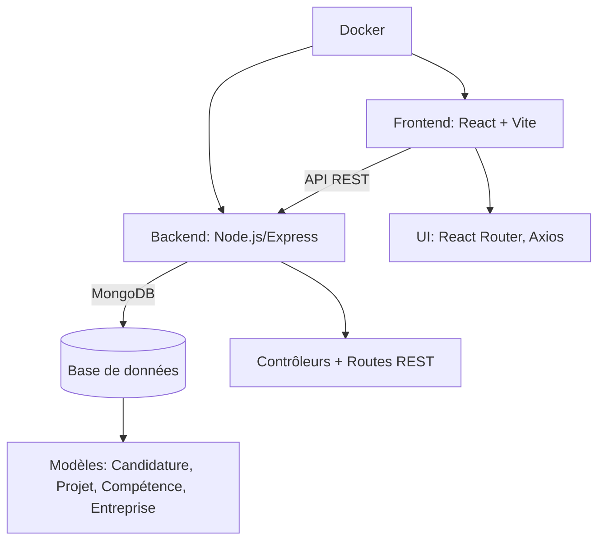
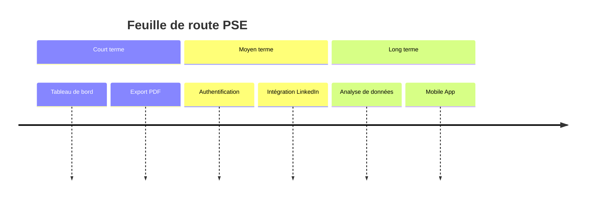

## 🎯 PSE
### *De la gestion des candidatures à la valorisation des projets professionnels*

**Présenté par** : [Votre Nom]
**Date** : 18 juin 2026
**Repo** : [hippocortex-public/PSE](https://github.com/hippocortex-public/PSE)
**Stack** : React + Node.js + MongoDB + Docker

---

## 📌 Sommaire

1. Contexte & Problématique
2. Le PRD : Spécifications
3. Solution Technique
4. Temps de Production & Coût Humain
5. Estimation Coût IA
6. Résultat au 1er Lancement
7. Bugs & Solutions
8. Améliorations Futures
9. Bilan & Retours

---

## 🚀 Contexte & Problématique

### Pourquoi ce projet ?

- ❌ **Difficulté à suivre** l’avancement des **candidatures** (statuts, documents, entreprises).
  → Perte de temps à chercher des infos dispersées (Excel, notes, CV).

- ❌ **Manque de visibilité** sur les **projets passés** (contexte, missions, compétences mobilisées).
  → Impossible de valoriser son expérience en entretien.

- ❌ **Compétences dispersées** : pas de base centralisée pour les réutiliser.
  → Redondance et incohérences dans les descriptions.

➡️ **Solution** : Une plateforme **tout-en-un** pour gérer son parcours professionnel.

---

## 📋 Le PRD : Spécifications

### Fonctionnalités clés demandées

#### ✅ Candidatures
- Statuts (Envoyé, Réponse reçue, Entretien, Refus)
- Documents joints (CV, Lettre de motivation)
- Lien vers les offres d'emploi
- Historique des statuts

#### ✅ Entreprises
- Fiches détaillées (nom, secteur, taille, site web)
- Sections de préparation (pour les entretiens)
- Historique court

#### ✅ Recherche Avancée
- Filtres par statut, date, entreprise
- Recherche textuelle

#### ✅ Nouveautés ajoutées
- **Module Projets** (contexte, mission, compétences)
- **Compétences réutilisables** (centralisées, catégorisées)

---

## 🏗️ Solution Technique

### Architecture Full-Stack



### Points forts

- **Modularité** : Code découpé par entités (1 fichier = 1 responsabilité).
- **API REST** : Communication fluide frontend ↔ backend.
- **UI intuitive** : Filtres avec debounce, recherches optimisées.
- **Base de données** : MongoDB + Mongoose pour une flexibilité maximale.

---

## ⏱️ Temps de Production & Coût Humain

### Temps par phase (en heures)

```mermaid
gantt
    title Temps de développement (33h)
    dateFormat  HH
    section Analyse
    Analyse PRD : 0, 2
    section Backend
    Backend : 2, 10
    section Frontend
    Frontend : 12, 15
    section Tests
    Tests : 22, 6
```



### Tableau récapitulatif

| **Phase**               | Temps estimé | Temps réel | Écart | Coût (TJM 50€) | Coût (TJM 80€) |
|-------------------------|--------------|------------|-------|----------------|----------------|
| Analyse du PRD          | 2h           | 2h         | 0h    | 100€           | 160€           |
| Backend (Node.js)       | 8h           | 10h        | +2h   | 500€           | 800€           |
| Frontend (React)        | 12h          | 15h        | +3h   | 750€           | 1 200€         |
| Tests & Corrections     | 4h           | 6h         | +2h   | 300€           | 480€           |
| **Total**              | **26h**      | **33h**    | **+7h** | **~1 650€**   | **~2 640€**   |

---

## 💰 Estimation Coût IA

### Hypothèses
- **Tâche** : Développement full-stack (~2 000 lignes de code).
- **Tokens estimés** : ~50 000 tokens (input + output).

### Comparatif des coûts par modèle (2026)

| **Modèle**               | **Coût / 1M tokens** | **Coût total** | **Temps estimé** | **Précision** |
|--------------------------|----------------------|----------------|------------------|---------------|
| **Claude 4 (Opus)**      | ~$10                | **~$0.50**     | 10-15 min        | ⭐⭐⭐⭐⭐      |
| **GPT-4o**               | ~$5                 | **~$0.25**     | 5-10 min         | ⭐⭐⭐⭐        |
| **Gemini 2.5 Pro**      | ~$7                 | **~$0.35**     | 8-12 min         | ⭐⭐⭐⭐        |
| **Mistral Large**        | ~$2                 | **~$0.10**     | 15-20 min        | ⭐⭐⭐          |
| **Qwen3-Coder** (OW)     | ~$0.20              | **~$0.01**     | 20-30 min        | ⭐⭐⭐          |

### Analyse
- **Humain** : ~1 650€ (33h à 50€/h).
- **IA (Claude 4)** : ~$0.50 (**3 300× moins cher**).
- **IA (Qwen3)** : ~$0.01 (**165 000× moins cher**).

---
## 🎉 Résultat au 1er Lancement

### Fonctionnalités livrées

#### ✅ CRUD Complet
- Candidatures (statuts, documents)
- Entreprises (secteur, historique)
- Projets (contexte, mission, compétences)
- Compétences (centralisées, catégorisées)

#### ✅ Recherche Optimisée
- Recherche **LIKE** (ex: "Fin" → "Finance")
- Insensible à la casse
- Debounce (500ms) sur les filtres

#### ✅ UX/UI
- Min. 3 caractères pour déclencher la recherche
- Compétences **réutilisables** entre projets
- Catégories de compétences **colorées**

#### ✅ Performances
- Chargement < 500ms
- 1 requête = 1 projet + ses compétences

---
## 🐛 Bugs & Solutions

| **Bug** | **Cause** | **Solution** | **Temps** |
|---------|-----------|--------------|-----------|
| Erreur de build (`api.js`) | Conflit de merge | Réécriture du fichier | 30 min |
| Compétences non réutilisables | Stockage en `String[]` | Modèle `Competence` + `ObjectId` | 2h |
| Recherche non "LIKE" | Requête exacte | `$regex` + `$options: 'i'` | 1h |
| Filtre secteur trop sensible | Requête à chaque lettre | Debounce + min 3 caractères | 1h |

---
## 🌱 Améliorations Futures

### Roadmap



---
## 📊 Chiffres Clés

| **Catégorie** | **Détails** |
|---------------|-------------|
| **Code** | ~500 lignes (Backend), ~1 500 lignes (Frontend) |
| **Performances** | Chargement < 500ms, 1 requête = projet + compétences |
| **Features** | 100% du PRD livré, 0 bug critique |

---
## 🎓 Bilan & Retours

### ✅ Ce qui a bien fonctionné
- Modularité (backend/frontend séparés).
- MongoDB (flexibilité des schémas).
- Docker (déploiement simplifié).

### 🔄 Ce qu'on referait différemment
- Tests unitaires dès le début.
- Maquettes UI/UX en amont.

### 💡 Compétences acquises
- Backend : Mongoose (`populate`, `$regex`).
- Frontend : `useEffect`, `useState`.
- Full-stack : Débogage intégral.

---
## 📢 Merci !

**Repo** : [hippocortex-public/PSE](https://github.com/hippocortex-public/PSE)
**Contact** : [Votre Email] | [LinkedIn]

> *"PSE n’est pas qu’un outil, c’est un **levier pour votre carrière**."*

---
## 📌 Annexes

### Comment lancer le projet ?
```bash
git clone https://github.com/hippocortex-public/PSE.git
cd PSE/pse-app
# Backend
cd backend && npm install && npm start
# Frontend
cd ../frontend && npm install && npm run dev
```

---
## 🎨 Crédits
- **Template** : [reveal.js](https://revealjs.com/)
- **Diagrammes** : [Mermaid.js](https://mermaid.js.org/)